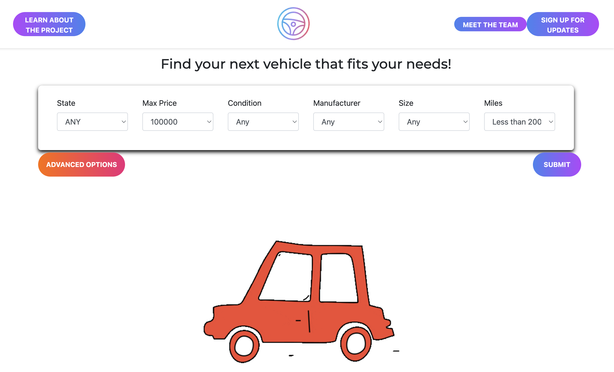
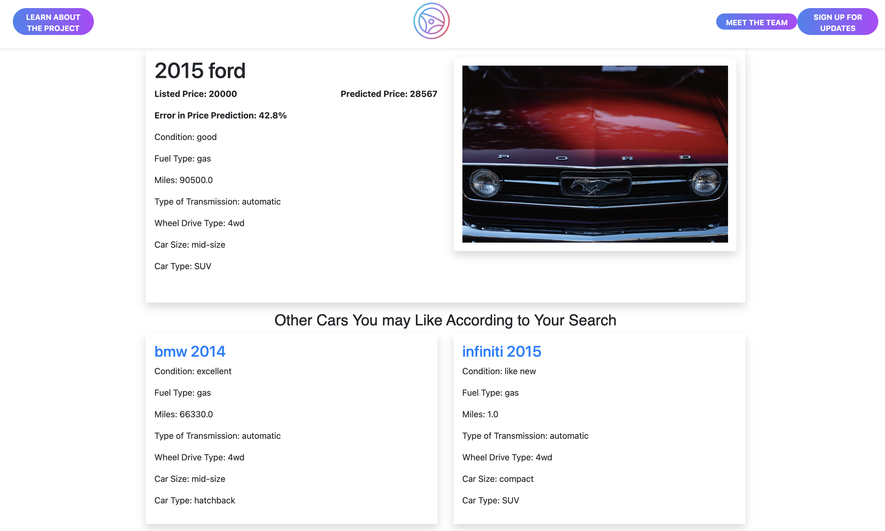

# Used Car Finder

## Description
An interactive search engine with selectable preferences for used cars on the market. 
We created two machine learning models to perform the following for the search engine:
1. Car price predictions (supervised learning)
2. Car recommendations (unsupervised learning)

## Info / Credits:
### Team
* [Jared Perez](https://github.com/jaredap1995)
* [Matthew Fernandez](https://github.com/mattf4171)
* [Bryan Tsan-Tang](https://github.com/bryan-tt)
* [Jen Alfson](https://github.com/jennyalfi)
* [Kolton Kie](https://github.com/kottonxie)
* [Irfan Sencer Senyurt](https://github.com/sncrsenyurt)
* [Kyle Stephens](https://github.com/KAMAS-2058)
### Repository
- `REPO:` https://github.com/jaredap1995/UCB_project_4
- `Analysis Last Updated:` August 21st, 2023
- `Report Last Updated:` August 21st, 2023
## Table of Contents
* [Introduction](#introduction)
* [Setup](#setup)
* [About the Data](#about-the-data)
* [Machine Learning Models](#machine-learning-models)
* [Front-End](#front-end)
* [Challenges](#challenges)
* [Future Plans](#future-plans)
* [Conclusion](#conclusion)

## Introduction
The purpose of this repository is to store all relevant data and scripting that enable the user to set up an interactive search engine which runs our machine learning models to search thousands of car listings and give you the most relevant recommendations and pricing. All tools and resources were produced for Project 4 of the 2023 UC Berkeley Data Analytics Bootcamp.
## Setup
### Conda Environment 
+ Create conda environment to ensure you have all needed packages
`conda create -n rootenv`
+ Activate conda environment
`conda activate rootenv`
+ Install needed packages
`pip install python scikit-learn pandas numpy psycopg2 flask ipython-sql sqlalchemy hvplot`
### Back-end
+ Data found within Kaggle: [https://www.kaggle.com/datasets/austinreese/craigslist-carstrucks-data]
+ Download csv file and place it within `data/` directory
#### Clean Data
[File: cleaning_analysis.ipynb](UCB_project_4/cleaning_analysis.ipynb)
+ Run `cleaning_analysis.ipynb`
+ `cleaning_analysis.ipynb` creates a new csv file within `data/` named `cleaned_vehicles.csv`
#### Data Retrieval from PostgreSQL
+ Set up DB named `proj_4`
+ run `used_cars.sql` to set up the table and schema
+ Import the `cleaned_vehicles.csv` into the table
### Regression model pickle file
+ Run `rand_forest_reg.ipynb` so regressor pkl file is saved into model_saves folder
+ **Warning** (~3 hour runtime)
## About the Data
|Name|Type|Description|Website|
|---|---|---|---|
|Used Cars Dataset | CSV | Includes every used vehicle entry within the United States on Craigslist. |https://www.kaggle.com/datasets/austinreese/craigslist-carstrucks-data|
### Cleaning the data
+ Removed NA records
+ Remove duplicate listings (multi-state listings)
+ Fake listings (Outliers)
    + Down payment prices
    + Monthly payment prices
    + $0 and $1 listings
    + Arbitrary price: $12345678 or $999999
+ Encoding
    + One hot encoding
    + Ordinal Encoding
#### Tools
* Jupyter Notebook
* Python Pandas
* Python Matplotlib

## Machine Learning Models
* Elastic-Net Regression
* Random Forest Regression
* K-nearest Neighbors Recommender

### Model 1: Elastic Net Price Prediction
[File: elasticnet_regression.ipynb](UCB_project_4/elasticnet_regression.ipynb)
#### Tools
* Jupyter Notebook
* Python Pandas
* Python Matplotlib
* Scikit-learn
* Psycopg2

### Model 2: Random Forest Price Prediction (optimal)
[File: rand_forest_reg.ipynb](UCB_project_4/rand_forest_reg.ipynb)

#### Tools
* Jupyter Notebook
* Python Pandas
* Python Matplotlib
* Scikit-learn
* Psycopg2

#### Model Creation:
* Applied Feature Engineering
* Applied Hyperparameter Tuning

### Model 3: K-nearest Neighbors Car Recommender
[File: car_recommender.ipynb](UCB_project_4/car_recommender.ipynb)

* Jupyter Notebook
* Python Pandas
* Python Matplotlib
* Scikit-learn
* Psycopg2
* hvplot

## Front-End
* Flask Web Application
* HTML
* Javascript
* CSS
### Website screenshots

## Challenges
* Random Forest Regressor Model training time (~ 3 hours)
* PKL file size (3.5 GB)
* Connecting front end routes with ML models
* Recommender model based on dynamic number of features
* Regression model based on dynamic number of features
* Data preprocessing (fake listings)
## Future Plans
* Add actual car images next to listings
* Time series analysis to forecast used-car prices
* Adding more accurate data
* Expand variability in recommendations (more about features less about price)

## Conclusion
In conclusion, our project successfully leveraged machine learning techniques to analyze a comprehensive dataset of used cars sourced from Craigslist listings across the United States. By developing a user-friendly web application using Flask, we aimed to provide an intuitive interface for users to explore, filter, and obtain valuable insights from the dataset.

The application featured three essential routes, each serving a distinct purpose. The initial landing page allowed users to apply various filters to pinpoint their desired car specifications. Subsequently, the results page displayed listings that aligned with the filtering criteria set on the previous page. The third route was dedicated to individual car listings, where users not only accessed essential car information but also witnessed the fruits of our machine learning efforts. Our proprietary machine learning model accurately predicted car prices, akin to the Kelly Blue Book estimated prices, in comparison with the actual listing prices. Moreover, the recommendations section utilized a k-nearest neighbors algorithm to suggest similar cars, enhancing the overall user experience.

The journey to creating an effective regression model was not without its challenges. Initially adopting an elastic net linear regression approach, we encountered limitations in achieving satisfactory predictive performance, with an inadequate R-squared value. In response, we strategically pivoted to a random forest regressor, which proved instrumental in yielding an optimal R-squared value exceeding 0.8. This change underscored the importance of adaptability and experimentation in refining our model.

Furthermore, the significance of data preprocessing was undeniable throughout our project. The familiar adage "garbage-in/garbage-out" resonated as we grappled with the intricacies of data quality. Recognizing the inadequacies within the dataset, we undertook a thorough data cleaning process. This involved eliminating records with missing values, addressing duplicates (including those spanning multiple states), and rectifying misleading listing prices. Instances of unconventional prices, such as users listing the down payment or monthly payment as the listing price – which deviates from the actual price of the car – along with listings set at $0 and $1, primarily intended to incite initial bids or offers rather than reflect the true car value, and arbitrary listing prices like 123456 or 999999, were all meticulously handled to ensure the accuracy of our analyses. Additionally, the application of one-hot encoding to categorical variables and the implementation of ordinal encoding were pivotal in preparing the data for our models.

In essence, our project encapsulated the symbiotic relationship between data exploration, machine learning, and user experience. By conquering challenges and refining our methodologies, we achieved an application that empowers users with accurate insights into used car prices and recommendations, bolstered by robust machine learning techniques. The project not only demonstrates the prowess of machine learning in real-world scenarios but also underscores the iterative nature of problem-solving in the realm of data science.

### Presentation slides
[Link to Google Slides](https://docs.google.com/presentation/d/10NptDFIsyLr6rpVkYUle41i7pjDDeAlkMsKC66Z0VeY/edit#slide=id.g22b11322dec_1_1577)
